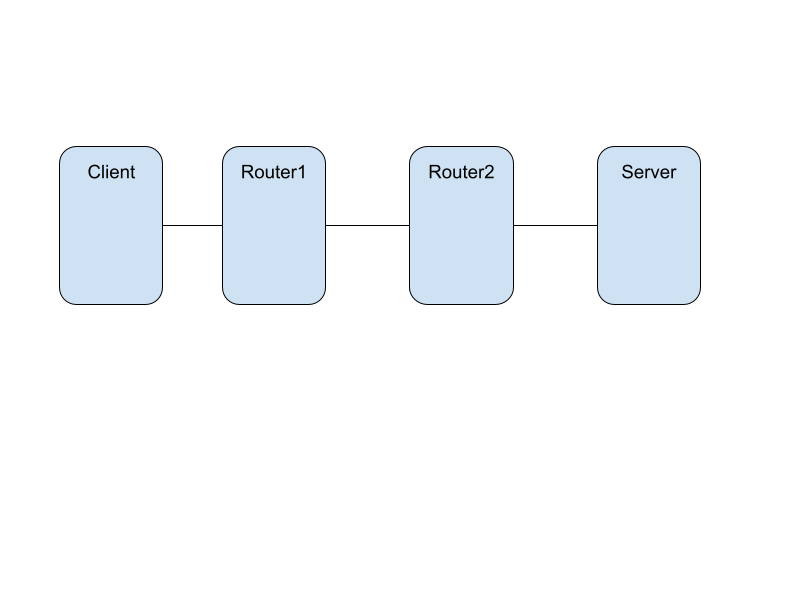
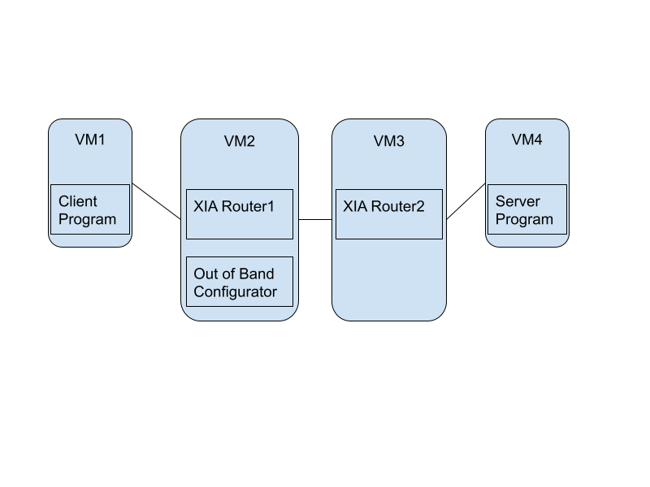
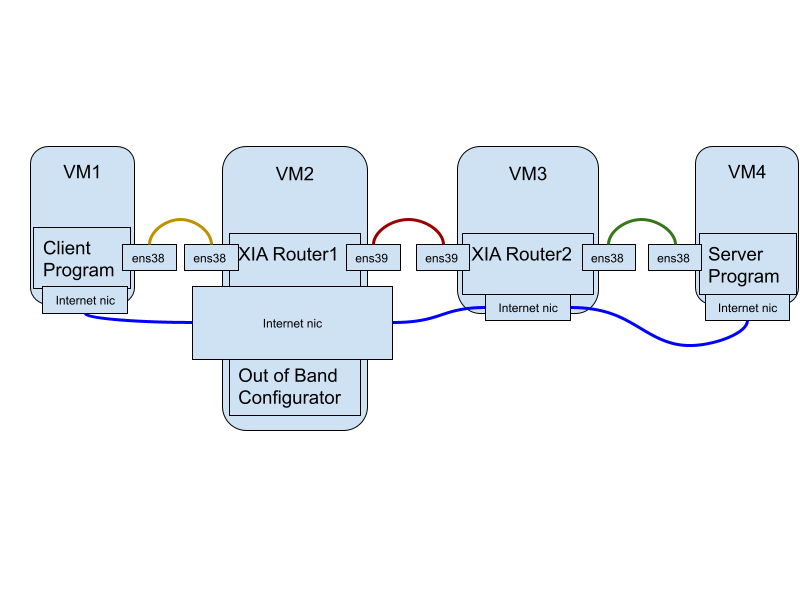
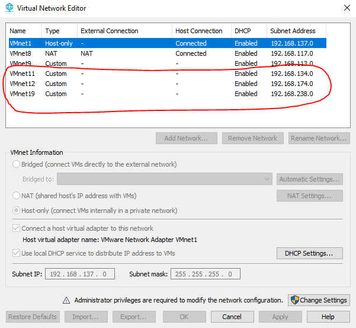
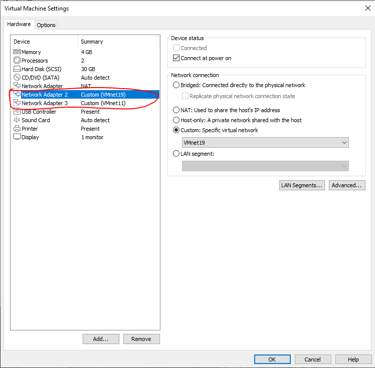

# project_documentation

## Overview
This doc walks through the process to setup the following basic topology with [XIA](https://github.com/XIA-Project/xia-core) Routers and [Picoquic](https://github.com/XIA-Project/picoquic) client and server programs. It is highly recommended for one to become familiar with the XIA project basics first; the "Overview of ASYNC Library" slides is a good reference.


More XIA project and Picoquic project documentations can be found in the [Documentations](#documentations) section.

The setup above involves many configuration details, which will hopefully be made clearer here.

## Setup

A separate VM will be needed to host each of the entities, with the exception that the emulator stack's out of band configurator can be hosted anywhere to distribute configuration information "out-of-band". For the sake of simplicity, the Internet is used (as out-of-band) instead of the XIA network (which in fact would not work since it's not yet communicating).

We assume the following setup



### Interfaces

The diagram below shows the basic setup. Each of the wires can be considered as a network. The blue ones together is the Internet, also the out of band communication medium. The other 3 are virtual wires. Each wire will be simulated using a virtual network.

Conceptually, a strong connection can be drawn between the diagram below and the "Overlay Network Emulator Design" page in the "Overview of ASYNC Library" slides. The out of band configurator would correspond to the emulator controller. The Helper programs in the slides are incorporated into the router scripts or the client/server programs. Normally, when there is configuration for "Control IP/Port" in code, it corresponds to the emulator stack.

Note that dynamic configuration for clients are also available. Each client can connect to multiple routers; configurations will be delivered by the emulation controller as well. Detailed configurations can be found in the client.conf files under e.g. `xia-core/tools/overlay`.




### Software Versions and initial setup

##### VMWare/VirtualBox
CMU provides access to VMWare software, the detailed instructions can be found [here](https://www.cmu.edu/computing/software/all/vmware/index.html). Feel free to try VMWare Workstation Pro or equivalent versions.

VirtualBox should also work.

##### VM Setup
[Ubuntu 18.04 Download page](https://releases.ubuntu.com/18.04/)

A few other things to install: git, net-tools, build-essential, (text editor).

##### Github setup (team invitation)

Developers must be invited to the correct Github team for the XIA project before proceeding; this is necessary for builds.

##### Github setup (SSH mode)

This step is necessary for cloning the repository and building the code. If you have never done this before, please follow the github SSH setup instructions [here](https://docs.github.com/en/github/authenticating-to-github/connecting-to-github-with-ssh).

##### Router VM Repository Setup

Clone the [xia-core Repository](https://github.com/XIA-Project/xia-core).

```
git clone git@github.com:XIA-Project/xia-core.git
cd xia-core
```

Switch to the xia-v2-overlay branch, which has the latest changes; then perform builds
```
git checkout xia-v2-overlay
make deps && make
cd click/userlevel && make
cd ../..
```

Install python and the packages `twisted`, `service_identity` and `netifaces`.

Build the protobuf definition for emulator stack
```
make deps && cd tools/overlay && make
```

If an error of the form "libdagaddr.so NOT FOUND" is reported, put the following line in `/etc/ld.so.conf.d/manual_click.conf` and run `sudo ldconfig`
```
    $XIA_CORE_REPO_PATH/api/lib # for libdagaddr.so
```

Finally, re-run `make`.


##### Client/server VM Repository Setup

Clone the [Picoquic Repository](https://github.com/XIA-Project/picoquic).

```
git clone git@github.com:XIA-Project/picoquic.git
cd picoquic
git submodule update --init --recursive
cd picotls; git checkout 584c4aea0cc180728da53ff2afcdec9166a6707a; cd ..
mkdir build
```

Install python and a few packages,

```
sudo apt-get install pkg-config
sudo apt-get install libprotobuf-dev protobuf-compiler
sudo apt-get install libssl-dev
pip install python-config
sudo apt-get install libxml2-dev libxslt1-dev
```

Make XIA dependencies and make picoquic
```
make xia
cd build; cmake ..
make
```

##### VM Name changes
This change must be performed on both the router and the client/server VMs. Before the change, the terminal prompt will likely be

```
r1@ubuntu:~/project/xia-core
```

Edit the hostname for the first router to `r1` (note this name is important in the upcoming configurations section) in
```
/etc/hostname
/etc/hosts
```

Restart the VM to see the changes:

```
r1@r1:~/project/xia-core
```

##### Links setup (Virtual Network)

In the diagram above, the blue links are out of band communication. In this case, the Internet is being used. Each of the other three links is simulated as a separate virtual network.

With VMWare software, the virtual networks can be created using the `Virtual Network Editor`. Since there are three links, three `Custom` type VMnets must be added.



Next, each VM will need new adapters to talk within the new Virtual networks. These can be added in the VM settings tab once the VMs are stopped, e.g.



Finally, power on the VMs to check if new network interfaces has been added. It is very likely that `ens33` will be the NAT interface for accessing the Internet. `ens38`, (`ens39` etc.,) will be the interfaces over which the XIA network is created, and the XIA packets are forwarded.

## Running the code


##### Configuration

In the example diagram provided above, assume `r1` runs on VM2 (note according to sections above, the VM must be named `r1` as well) and `r2` runs on VM3. Since VM2 is also used as the out of band configurator in the emulator stack for delivering configurations, the configurations to be delivered must be configured on VM2.

Edit `tools/overlay/demo.conf` to configure the routers,
```
[r1]
Interfaces = ens38,ens39
ControlAddress = 192.168.117.141 # the address for ens33, which is used to receive control information, i.e. emulator configuration information.
HostInterface = ens38 # interface on this router VM through which the client/server VMs will connect
HostAddr = 192.168.134.129 # the address for ens38 (the host interface)
NameServer = true # only true for r1
Route_r2 = ens39 -> ens39:r2 # assuming that r1 will talk to r2 over ens39

[r2]
Interfaces = ens38,ens39
ControlAddress = 192.168.117.142
HostInterface = ens38
HostAddr = 192.168.174.129
Route_r1 = ens39 -> ens39:r1
```

Edit `tools/overlay/events.conf`
```
[e1]
delay=2
add_r1=r2
add_r2=r1
```

Edit `tools/overlay/client.conf`, for configuring client/server stack.
```
[c1]
AID=AID:69a4e068880cd40549405dfda6e794b0c7fdf192 # Generated string
ControlAddress=192.168.117.143
ControlPort=8295 # fixed number that will be seen below)
Routers=r1 # list of names of the routers to connect to
Interfaces=ens38 # list of interfaces to connect to each router with
Default=r1 # default router to connect to if there are more than 1
ServerDag= RE AD:... HID:... AID:69a4e068880cd40549405dfda6e794b0c7fdf195

[s1]
AID=AID:69a4e068880cd40549405dfda6e794b0c7fdf195 # Generated string
ControlAddress=192.168.117.144
ControlPort=8295
Routers=r2
Interfaces=ens38
Default=r2
ServerDag= RE AD:... HID:... AID:69a4e068880cd40549405dfda6e794b0c7fdf195
```

In particular, the `AD:... HID:...` information can be ignored first. When running the program for the first time with the steps below, this information will be reported along with some expected errors (as the configuration is incomplete). The information will be reported in the logs of the form:

```
Sent %d byte packet to server: ${SERVER_DAG}) from me: ${MY_DAG}
```

The `AD:... HID:...` piece should then be replaced with the reported information.

#### Edit Client/Server program

On client/server VM, edit the `picoquicfirst/picoquic{client/server}xia.cpp` file. The macro definition of `CONTROL_IP` should reflect the ip address associated with the control interface.
```
#define CONTROL_IP "192.168.117.144" // ens33 - NAT
```

Rebuild the repository after editing.

##### Test Run

First, start up these scripts on the Routers

```
sudo python2 tools/overlay/xiaconfighelper.py
```

Next, start up the client/server programs on the client/server VMs
```
cd build
sudo ./picoquic{client/server}xia
```

Finally, run the configurator script on the VM with the out of band configurations.
```
sudo python2 tools/overlay/xiaconfigurator.py
```

The configuration order is as follows:
- Configure routers (demo.conf)
- Run events (events.conf)
- Configure clients (client.conf)

After configuration, the client and server program should communicate. We believe CID PUSH combination is used from between client/server programs and the XCaches. Details for address types can be found in the slides.

## Documentations

- XIAWiki: https://github.com/XIA-Project/xia-core/wiki
- Picoquic: https://github.com/XIA-Project/picoquic
